> ** ALPHA VERSION. Software is not finished. CHOO CHOO.**

```*        .         *               .            *
   ______ __ __  ____   ____   ______ __ __  ____   ____
  / ____// // / / __ \ / __ \ / ____// // / / __ \ / __ \
 / /___ /  __  // /_/ // /_/ // /___ /  __  // /_/ // /_/ /
 \____//_/ /_/ \____/ \____/ \____//_/ /_/ \____/ \____/

             ______  ___    ___    ______  __  __  ______  ____
            /_  __/ / _ \  / _ |  / ____/ / /_/ / / ____/ / _  \
             / /   / , _/ / __ | / /___  /  _  / / _/   / , _/
            /_/   /_/|_| /_/ |_| \____/ /_/ |_| /____/ /_/|_|

       -=[ MOBILE GROOVEBOX, MULTI-ENGINE TRACKER ]=-
             _________________________________
       _____/  ___                ___         \_____
   ___/_____|_|___|______________|___|_____________\___
  /  _   _   _   _   _   _   _   _   _   _   _         \
 |  |_| |_| |_| |_| |_| |_| |_| |_| |_| |_| |_| |RG353| |
 |______________________________________________________|
    O==O       O==O             O==O       O==O
 _.-'--`-.___.-'--`-.___==___.-'--`-.___.-'--`-._
==========================================================>
     CAHORS                                       MONTAUBAN
          >>>  8 TRACKS  / CHIPNOMAD-BASED  >>>

.oO[ AY / BRAIDS / PLAITS / SAMPLES / WTBL / DRUMSYNTH / 303 ]Oo.
````

## Screenshots

<p align="center">
  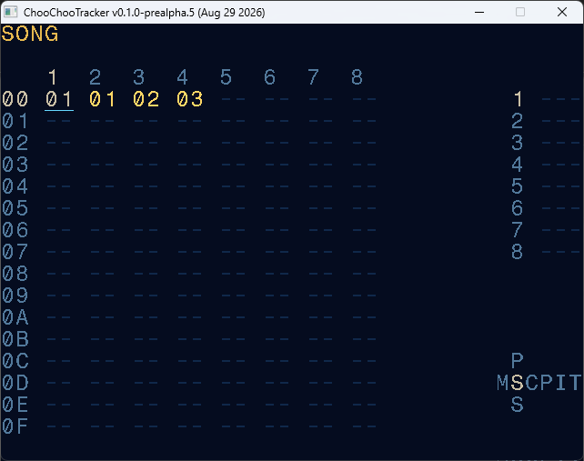
  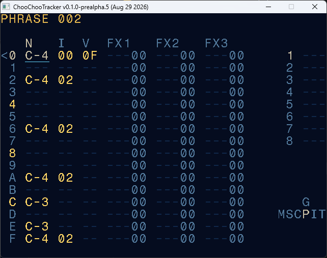
  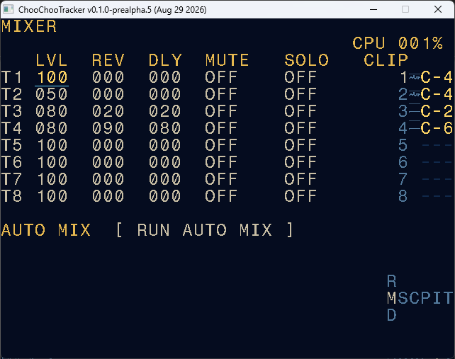
</p>
<p align="center">
  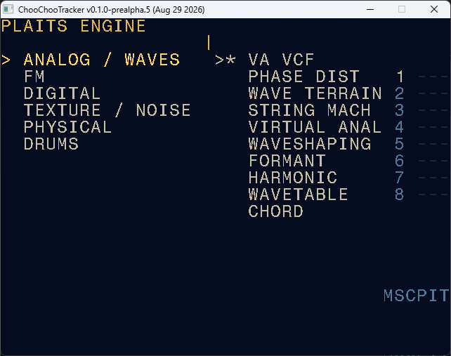
  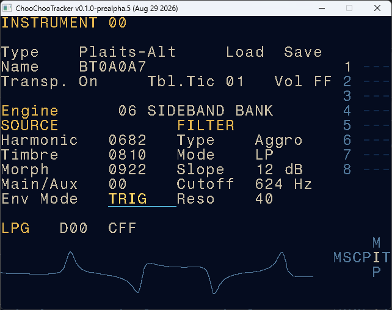
  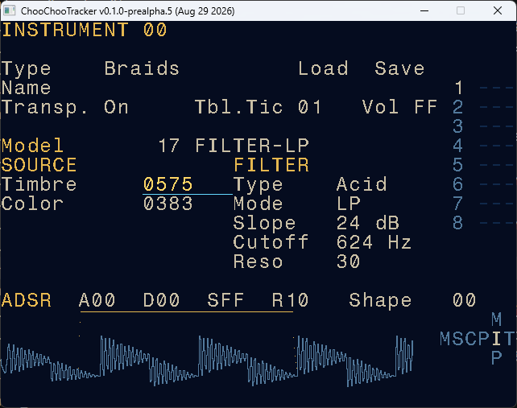
</p>
<p align="center">
  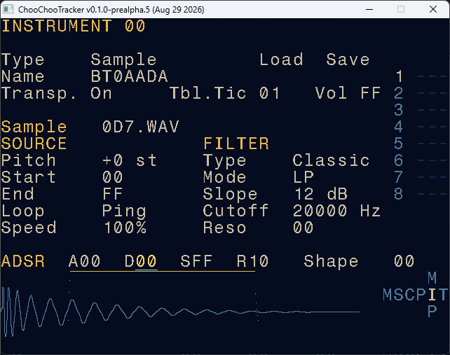
  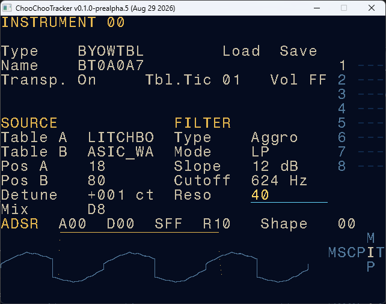
  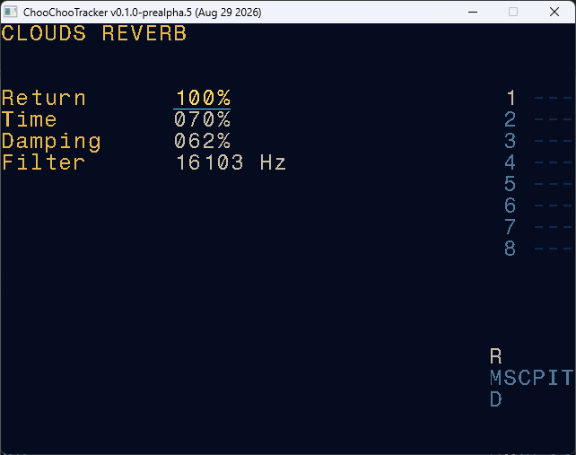
</p>
<p align="center">
  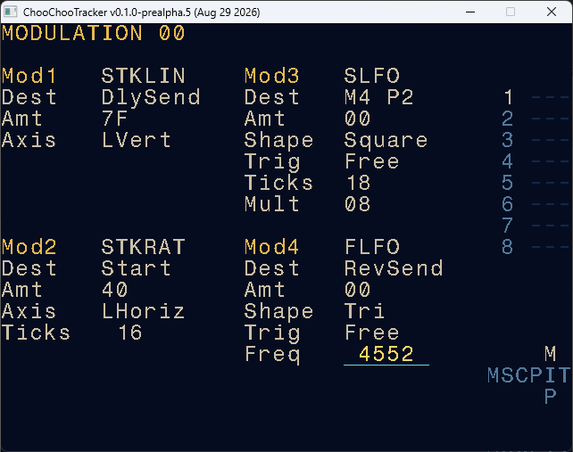
  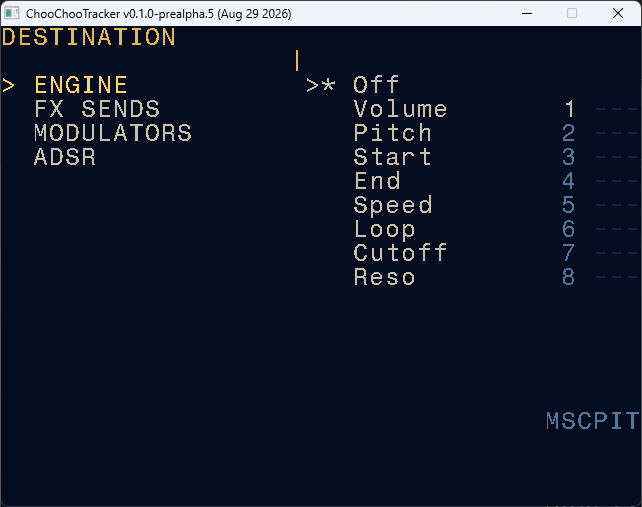
  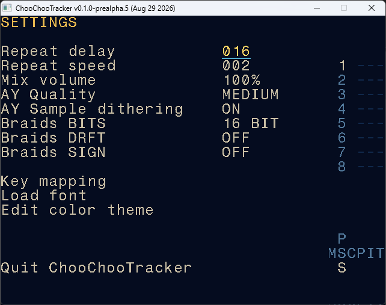
</p>

ChooChooTracker is a music tracker for handheld consoles, PC and Android.

Write a beat on the train, sequence, jam with joysticks, automate a synth line, send it through reverb, then keep going until you miss your stop.

This is a fork of [ChipNomad](https://github.com/Megus/chipnomad-tracker), with A LOT of extra synth engines, high quality PCM samples / SCWF / Serum wavetables playback, global reverb/delay, and many other small changes. It keeps ChipNomad's supafast LSDJ-inspired tracker workflow but departs from the chiptune vision of Megus to offer a wide range of modern sound design options. The name comes from the first proof of concept, written on a train between Cahors and Montauban.

The main target is the Anbernic RG353V through PortMaster. It should work on any Portmaster system. So far tested and working on Arkos and TrimUI.

A native Windows build is available for development and desktop testing. It works on Steamdeck if you feel adventurous.

You can also test it in your browser on https://choochootracker.vercel.app/ (use the keyboard or gamepad on a computer, use the on-screen gamepad on a mobile device). 

Android version is available in "closed beta", contact me on Discord https://discord.gg/Ut9vM6zgKU to get access.

Other platforms: the app is SDL2 based, it should compile anywhere.

## What it can do

Synthesis
- Eight fixed monophonic tracks (with independent instruments)
- AY Classic, AY Plus, and crunchy AY Sample playback (from Chipnomad)
- All 47 Braids engines, 24 stock Plaits engines, and 24 additional Plaits-Alt engines
- Clean mono or stereo PCM8/PCM16 sample playback (one-shot samples, like your Digitakt)
- Dual single cycle waveform oscillator: with mix & detune
- Dual wavetable oscillator: bring your own Serum wavetables !
- Achchid: acid engine (open303 based) that can take Braids as VCO
- Bogie: In-house drum synth with 12 VA/FM models (including cowbells).
- MME: Multi Modulation Engine. An aggressive voice inspired by the Loquelic Iteritas, but with Mutable Warps algos
- Multimode LP/HP/BP 12/24dB filters for all new synth/sample engines
- Several filter flavours inspired by analog synths
- Per-track volume, mute, solo, tiltEQ, Reverb send, and Delay send
- Mutable Instruments Clouds meme lush reverb
- Tick-synchronized filtered ping-pong delay

Articulations
- Three tracker FX columns per row
- Added tracker FX inspired by Elektron and Nerdseq: Probability, modulo conditions, and per-track invididual playback speed
- Synth engines parameters can be set by TrackFX, kinda like P-locks.
- 4x mod sources per track: ADSR, AHD, LFO and joysticks. Modulations can target modulations.
- 3 LFO types: normal, slow tempo sync'd (can be very slow) and fast LFO for audio rate modulations
- AY Wavetables as LFO shapes
- LFO can retrig on phrase & chains start (in addition to standard lfo trigs)
- Joystick modulation , that can be live recorded as trackFX 
- Tracker tables (4 FX slots per table row), grooves, chains, and songs

## One tracker, many engines

Instruments in Choochootracker work like "Machines" in the Elektron world.

Each instrument has its sound engine, and can be mixed/matched at will: you can have an AY bass on one track, a Braids drum model on another, a Plaits chord engine or a Plaits-Alt texture on the next, and some repitched heehaa samples beside them.


## Handheld workflow

The main screens follow the `MSCPIT` layout:

```text
Rvrb    Proj           Groov    Modulations
Mixer - Song - Chain - Phrase - Instrument - Table
Dlay    Sett                    Pool         Wvtbl
```
So its kind of like LSDJ, but with a Mixer on the left.

## Try the alpha

Download the PortMaster package and PDF manual from the [GitHub Releases page](https://github.com/paiheulevrai/Choochootracker/releases).

The current package targets ARM64 PortMaster devices and has been developed primarily for ArkOS on RG353V. Install `choochootracker.zip` through PortMaster, or extract it into the console's `ports` directory.

This is an early test build. Save often and don't get too attached to your projects.

Find bugs or anything? Come discuss on Discord: https://discord.gg/Ut9vM6zgKU

## Documentation

- [User manual](docs/USER_MANUAL.md)
- [User manual PDF](docs/ChooChooTracker-User-Manual.pdf)
- [Development overview and roadmap](docs/dev_readme.md)
- [Development notes](docs/development-notes.md)
- [Feasibility study](docs/feasibility-2026-08-09.md)
- [Fork maintenance guide](docs/fork-maintenance.md)

## Current limits

- Everything is mostly working, you can make music.
- there may still be some crashes and bugs
- Visual identity is not final
- need to tweak the scaling of various controls (like linear vs expo, that kind of stuff)

## Why the train name?

I wanted a mobile groovebox to make techno... but none of the available option ticked all the boxes, so I decided to make one. The first proof of concept was written during an Intercité train ride between Cahors and Montauban, so the name stuck. Choo choo, don't miss your stop.

## Credits and license

ChooChooTracker is a fork of [ChipNomad](https://github.com/Megus/chipnomad-tracker). Its Braids, Plaits, Clouds, and stmlib code comes from Mutable Instruments' open-source releases. See the included license files for exact attribution.

The project is released under the [MIT License](LICENSE).

Mad respects to the people I stole code from:
- Megus, the insanely smart creator of Chipnomad.
- Pichenettes, the genius behind Mutable Instruments
- Lylepmills for the additional Plaits engines
- RobinSchmidt for the Open303 engine

Mad respects to the people I stole ideas from:
- Thomas, the absolute beast behind Nedseq
- The people at Elektron who boldly put user workflow and speed first, and also whoever invented P-locks and trig conditions.
- Whoever invented the menu navigation style of vintage RPGs
- All musicians who I saw playing live sets on gameboys and other constrained hardware rigs.
