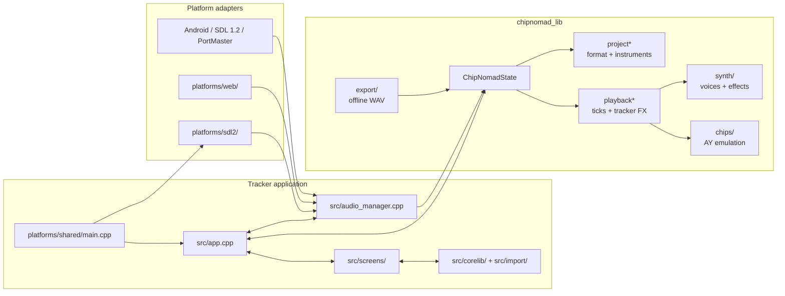
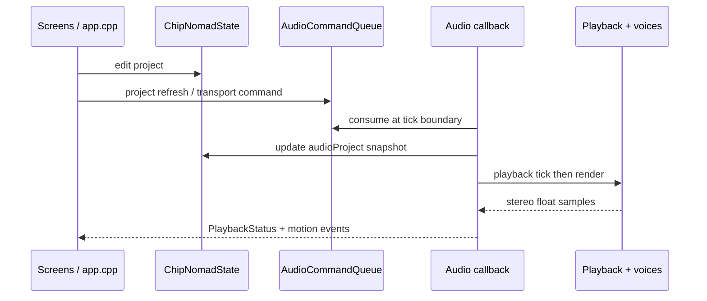
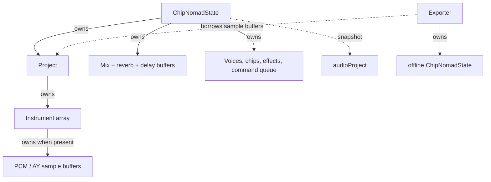

# Codebase map

This is an intentionally small map of the code that changes behaviour. It is
not a file-by-file dependency graph: generated full graphs obscure the paths
where a change can affect audio, project data, or a platform build.

## Real-time boundary

This is the most important graph when reviewing a change. UI code owns the
editable `project`; the audio callback reads `audioProject`. Do not add direct
UI writes from audio code, allocation, filesystem access, or locks on the
audio side.

## Ownership map

Use this before changing imports, loading, samples, or export. Solid arrows
mean ownership; dashed arrows mean a temporary or read-only view.

## Review paths

Start at the narrowest path that contains the change.

| Change | Read first | Then trace |
| --- | --- | --- |
| Tracker UI or navigation | `tracker/src/screens/`, `screens.cpp` | `app.cpp`, project/file callbacks |
| Project format or sample ownership | `chipnomad_lib/project*.cpp` | `screen_project.cpp`, importers, `chipnomadDestroy()` |
| Playback or FX | `playback.cpp`, `playback_fx_*.cpp` | `chipnomadRender()`, targeted voice |
| New synth parameter | matching `synth/*_voice.cpp` | `project_instruments.*`, instrument screen, FX metadata |
| Audio glitches or races | `audio_manager.cpp`, `chipnomad_lib.cpp` | queues, buffer allocation, platform callback |
| Platform-specific breakage | matching `tracker/platforms/*/` | `Makefile.*`, packaging and assets |

## Practical use

For a suspected improvement, mark its entry point on the first graph, then
follow every outgoing arrow until ownership or thread boundary changes. If a
proposed change crosses into the audio callback, require a targeted test and a
desktop stress run. Keep a generated Doxygen/Graphviz graph as a local search
aid only; this hand-maintained map should remain the readable architectural
reference.
