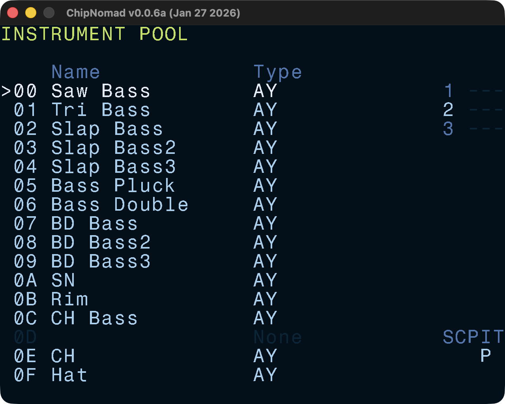

# Instrument Pool Screen

This is a convenient screen where you can see all project instruments and reorder them. Also, during the playback you can see instruments that are playing currently.

### Controls

- **EDIT**: edit instrument (jumps to Instrument screen)
- **SHIFT** + **OPT**: copy instrument
- **SHIFT** + **EDIT**: paste instrument
- **EDIT** + \[**UP** or **DOWN**\]: reorder instruments
- **EDIT** + **PLAY**: preview instrument
