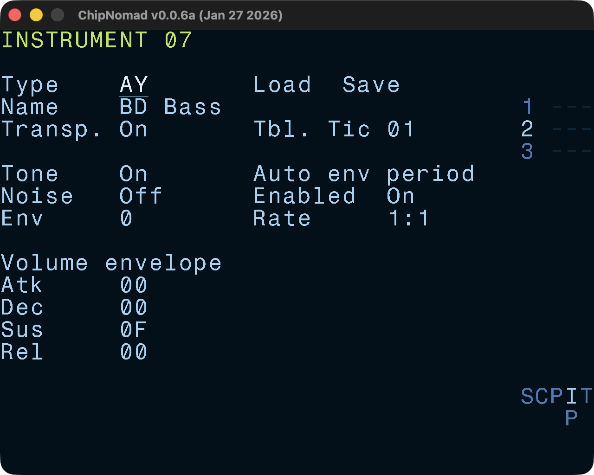

# Instrument Screens

- [AY Classic Instrument](/manual/instrument-screen/ay-classic/)
- [AY Plus Instrument](/manual/instrument-screen/ay-plus/)
- [AY Sample Instrument](/manual/instrument-screen/ay-sample/)

## Common instrument parameters

All instruments have a few common parameters:

- Instrument type (currently None or AY)
- Name (up to 15 characters)
- Default table speed (ticks per table row)
- Transpose enable/disable

Each instrument has a corresponding default table which has the same number (00-7F range). While you can use tables in 00-7F range as aux tables, it is not recommended to do so for simplicity. Tables are the main sound design tools in ChipNomad.

### Controls

- **OPT** + \[**LEFT** or **RIGHT**\]: navigate between instruments:
- **EDIT** + **PLAY**: preview instrument:
- **SHIFT** + **OPT**: copy instrument
- **SHIFT** + **EDIT**: paste instrument
