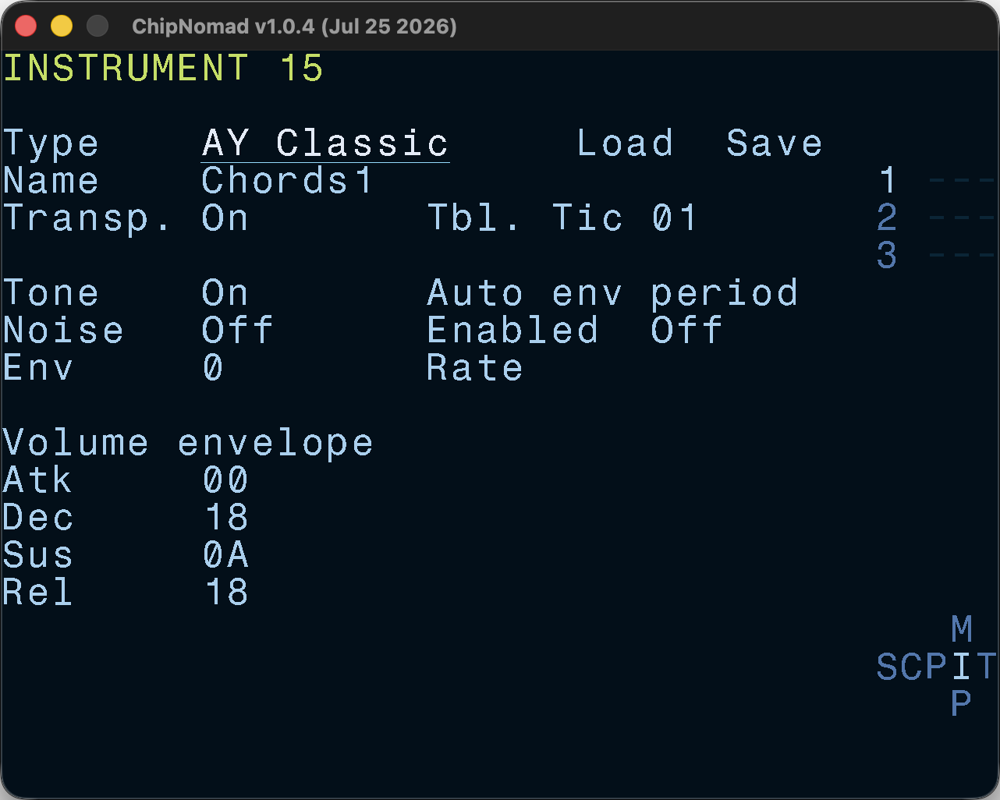

# AY Classic

This is a legacy instrument type from ChipNomad v1.0.0. The new [AY Plus](/manual/instrument-screen/ay-plus/) instrument offers more features.

**AY Classic** instruments have these parameters:

- Mixer: tone on/off, noise on/off, envelope shape (0-F)
- Volume ADSR envelope (software generated)
- Auto envelope period settings: enabled/disabled, rate (1:1 - F:F)

To understand the parameters, check [AY-3-8910/YM2149F overview](/chips/ay-3-8910/).

A couple of things to try:

- Disable both tone and noise, set env shape to 8 (saw). Enable auto envelope and set rate to 2:1. You've got a nice thick bass sound.
- Enable tone, disable noise, set env shape to E. Enable auto envelope and set rate to 2:1. You've got a classic "flowing" AY env bass sound. Experiment with rate values, you can get some interesting sounds, especially when rates are not powers of 2 (e.g. 1:3). Enabling both tone and envelope creates ring modulation between the tone square wave and the wave from the envelope generator. The "flowing" effect is created by the difference in tuning precision — envelope period control is less precise.
