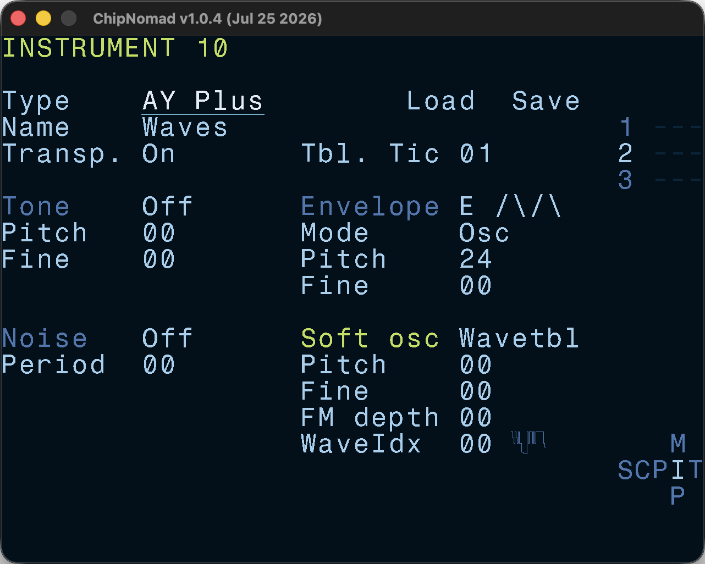

# AY Plus Instrument

**AY Plus** instrument applies classic synthesizer concepts to [AY-3-8910/YM2149F](/chips/ay-3-8910/) sound design. AY can be seen as a synthesizer with 5 oscillators:

- 3 square wave tone oscillators
- 1 noise oscillator
- 1 amplitude envelope generator which can be used as an oscillator

Under this model each instrument has 3 hardware oscillators: tone, noise, envelope. AY Plus also introduces 4th oscillator — software osc. Updating AY register at rates faster than the project tick rate allows more sound possibilities. Due to the way AY works, all oscillators are mixed using ring modulation. Experimenting with pitch offsets, detuning, and various combinations of oscillators opens a rich palette of sounds.

Each tonal oscillator can be tuned independently with pitch and fine tune offsets.

Software oscillator types and their parameters:

- **Pulse** — square wave with controllable pulse width
  - FM Depth — simple FM depth
  - Pulse width — the full range is 00-FF but the number of steps is set at the [Project screen](/manual/project-screen/).
  - Pulse low — software is generated as a series of 2 values: high value (always 15) and low value, controlled with this parameter.
- **Sync Tone** — hard sync effect for the tone oscillator
  - FM Depth — simple FM depth
- **Sync Env** — hard sync effect for the envelope osc
  - FM Depth — simple FM depth
  - Pulse width — duratiopn ratio between envelope shapes in the evnelope pair
  - Envelope Pair — two envelope shapes to switch between
- **Wavetable** — 32-step wavetables. You can edit them at the [Wavetable screen](/manual/wavetable-screen/)
  - FM Depth — simple FM depth
  - Wavetable index
- **Tone FM** — simple FM-like effect for the tone oscillator
  - FM Depth — tone FM depth
- **Env FM** — simple FM-like effect for the envelope oscillator
  - FM Depth — env FM depth

Pulse and Wavetable software oscillators can't be used together with the Envelope oscillator. Envelope oscillator is automatically turned off.

The simple FM works as a quick modulation between two period values: one is lower, another one is higher. It is somewhat similar to using a square wave as FM modulator. For Pulse, Sync Tone, Sync Env, and Wavetable oscillators you can see it as 1:1 ratio between the FM carrier and modulator. Tone FM and Env FM let you imitate different ratios by using software oscillator pitch offsets.
