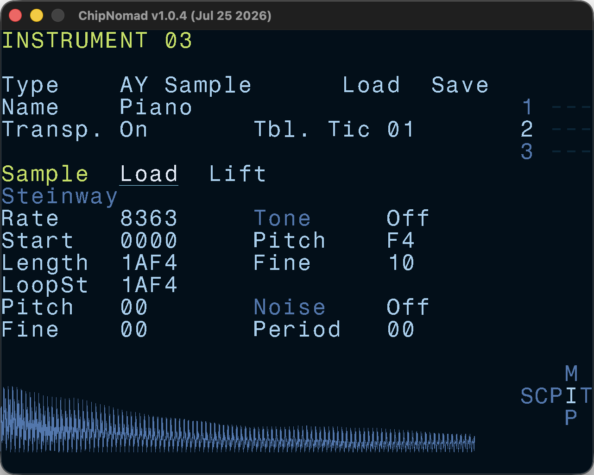

# AY Sample Instrument

You can load 8/16/24/32-bit mono/stereo WAV files. They will be converted to 8-bit and truncated up to 16KB. 16KB limit was chosen to keep it true to the retro hardware (16KB is the RAM page size on ZX Spectrum).

Sample playback on AY is possible by fast writes to the volume register. The output is unipolar, so for better playback samples need to be "lifted to zero". Lifting samples eliminates clicks at the end of a sample and gives better quality of the quiet sample tail.

AY has 4-bit DAC resolution with non-linear volume scale, so 8-bit samples are converted to 4-bit during playback. You can improve the perceived bit depth of sample playback by enabling **sample dithering** option at the [Settings screen](/manual/settings-screen/). Please note that dithering is not really possible on the retro platforms like ZX Spectrum and Atari ST, so if you're making music for the real hardware or want crunchy lo-fi sound, keep dithering disabled.

Samples can be seen as another software oscillator type of [AY Plus Instrument](/manual/instrument-screen/ay-plus/), but because they have many additional parameters, they were implemented as a separate instrument type.

Sample parameters:

- Sample rate — the assumption is that sample played at its native sample rate gives C-4 pitch.
- Sample start
- Sample length
- Sample loop start
- Sample pitch offset
- Sample fine pitch offset

Tone and Noise oscillators sections are equivalent to [AY Plus Instrument](/manual/instrument-screen/ay-plus/). Due to the way AY works, all oscillators are mixed using ring modulation.
