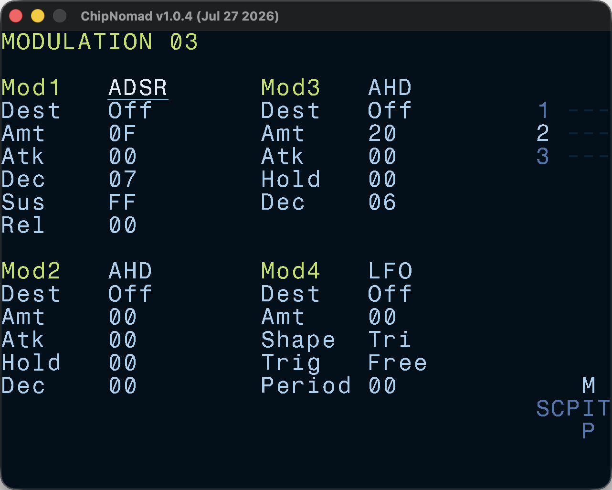

# Modulation Screen

You can define up to 4 modulations for various instrument parameters. This screen is almost equivalent to the Modulation screen of the Dirtywave M8 tracker.

There are three modulation types:

- **ADSR** — classic attack-decay-sustain-release envelope
- **AHD** — attack-hold-decay envelope
- **LFO** — low frequency oscillator with multiple shapes

The list of modulation destinations depends on the instrument type. When ADSR or AHD envelope targets Volume parameter, it becomes the volume envelope of the instrument, unlike LFO which would offset the current output voulme.

Modulation amount can be both positive and negative. The range depends on the destination parameter. If the full range of the destination parameter is 127 or less (most parameters), then modulation amount defines the absolute range. If the full range of the destination parameter is greater (for example, pitch), then the modulation amount range is scaled.

All duration parameters (attack, hold, decay, period) are in ticks.

LFO shapes:

- **Tri** — bipolar triangle wave
- **Sin** — bipolar sine wave
- **UniTri** — unipolar triangle wave
- **UniSin** — unipolar sine wave
- **RampDn** — linear ramp down (saw wave)
- **RampUp** — linear ramp up (saw wave)
- **ExpDn** — exponential ramp down (exp saw wave)
- **ExpUp** — exponential ramp up (exp saw wave)
- **Square** — square wave
- **Random** - sample-and-hold random wave

LFO trigger types:

- **Free** — LFO is only restarted when instrument is changed
- **Retrig** — LFO is restarted on every note
- **Hold** — After 1 cycle of LFO wave it stops and stays on the last value
- **Once** — After 1 cycle of LFO wave it stops and stays on the zero value
