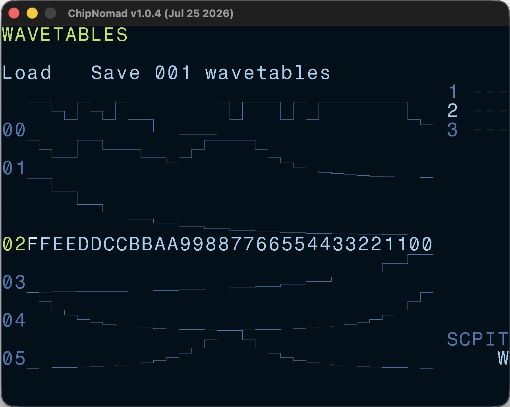

# Wavetable Screen

One of [AY Plus](/manual/instrument-screen/ay-plus/) software oscillator types is the Wavetable. You can have up to 256 32-step wavetables in a project. All wavetable instruments use the same set of waves. This screen is dedicated to editing wavetables.

AY volume levels are non-linear, and the waveform is rendered true to the actual output levels.

The screen is organized as 2 logical rows with the top row dedicated to load/save buttons, and the second row is the wavetable editor.

## Controls

Use the common edit functions (**EDIT** + **DIRECTION**) to edit the selected wavetable. In addition to the common controls these key combinations are available:

- **OPT** + \[**LEFT** or **RIGHT**\]: navigate through the wavetable list
- **OPT** + \[**UP** or **DOWN**\]: navigate through the list by 16 waves
- **SHIFT** + **OPT**: copy wavetable
- **SHIFT** + **EDIT**: paste wavetable
